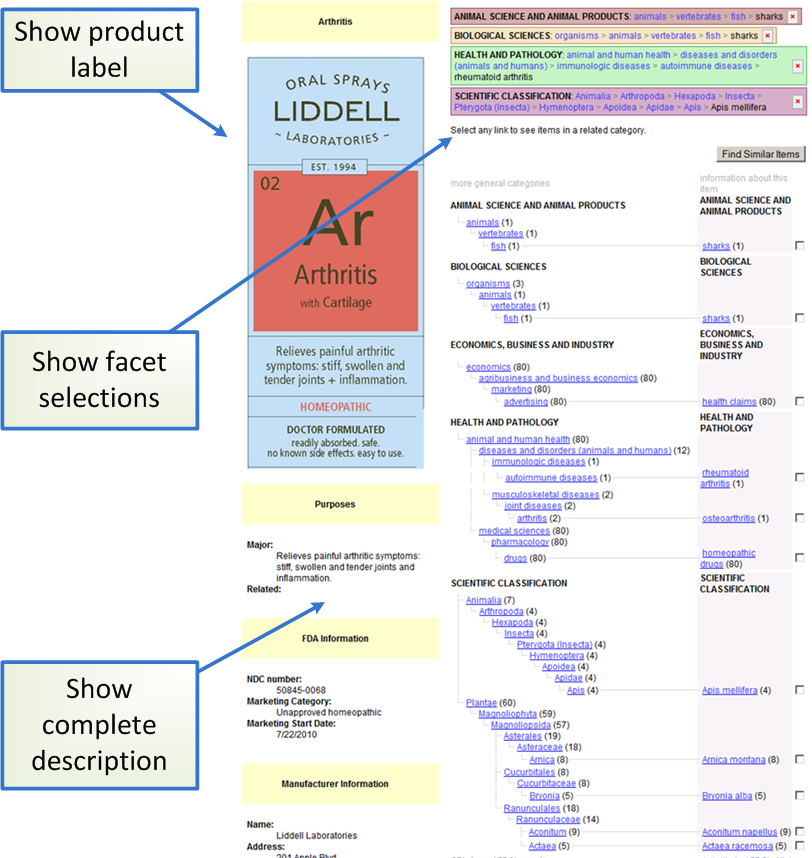
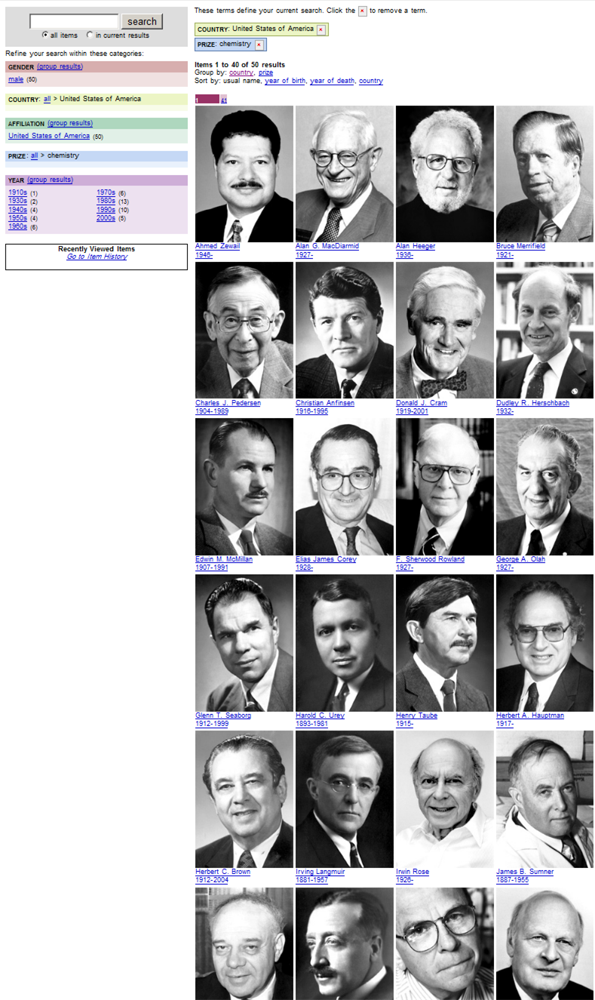

.. _$_02-core-09-user-friendly:

=====================
User Friendly Designs
=====================

.. _return-to-top-02-core-09-user-friendly:

This section addresses:

.. rst:role:: USDA #1

   User-friendly design for rapid deposition, manipulation, and retrieval of data with capability of specific queries.

Table of Contents
-----------------

.. contents::
   :depth: 3
   :local:

--------------------
Ontomatica Navigator
--------------------

Ontomatica's :ref:`Navigator <terms-Navigator>` |_| architecture is similar to other modern navigation systems. The Volkswagen `"Find a Match" application <http://www.vw.com/find-match/engine/>`_ is one example.

.. figure:: $_02-core-09-user-friendly-1-volkswagen_.png
   :align: center

The Volkswagen application navigates this `ontology <http://ontorule-project.eu/parrot/parrot?documentUri=http://www.volkswagen.co.uk/vocabularies/vvo/ns.owl>`_. See also: :cite:`5043`  :cite:`5044` :cite:`5045`.

Ontomatica's Navigator, traversing the :ref:`graphs <terms-Graph>` |_| implemented in the `homeopathic application <http://72.167.253.87/cgi-bin/flamenco.cgi/_Homeopathic_Remedies_-_14-01-16_/Flamenco?q=arthritis&index=0>`_, operates in the same way as the Volkswagen navigator, but use different data.

--------------------------------------
Navigator's Underlying Data Structures
--------------------------------------

Volkswagen and Ontomatica use the same underlying technology for specifying and storing data. Both specify data using ontologies and store ontology representations in the following formats:

- `Web Ontology Language <http://en.wikipedia.org/wiki/Web_Ontology_Language>`_ |_| (OWL)

- `XML/RDF <http://en.wikipedia.org/wiki/Resource_Description_Framework>`_

- `JSON-LD <http://en.wikipedia.org/wiki/JSON-LD>`_

--------------------------------
Navigator and USDA Label Project
--------------------------------

Ontomatica Nobel Prize application illustrates :ref:`application services <terms-Application-Service>` |_| navigating :ref:`data services <terms-Data-Service>` |_| that manage content familiar to many. For example, here are `U.S. Nobel Laureates in Chemistry <http://72.167.253.87/cgi-bin/flamenco.cgi/_Nobel_Prize_Winners_-_14-01-16_/Flamenco?q=country:50/prize:1&group=country>`_.

   
   U.S. winners of the Nobel Prize for Chemistry

:ref:`Complete System <terms-Complete-System>` |_| will look and operate like the Nobel Prize applications and the Volkswagen "Find a Match" application.

In place of the Nobel Laureate's picture will be the branded food label image registered by a :ref:`supplier <terms-Food-Supplier>` |_| during the :ref:`web deposit <terms-Web-Deposit>` |_| process.

All queries are represented as a `Universal Resource Identifier <http://en.wikipedia.org/wiki/Uniform_resource_identifier>`_ |_| (URI). This means that an :ref:`end user <terms-End-User>`, :ref:`investigator <terms-Investigator>` |_| and supplier can easily link to and re-use a reference to a food.

Ontomatica's Navigator, as of 2015, is unique in the technology marketplace.

Some modern tools enable a user to compose a query by selecting two or more single-level facets. An example is `NCCOR <http://tools.nccor.org/css/>`_.

Only Navigator enables a user to compose queries by selecting terms from multiple hierarchies of terms.

:ref:`Return to top <return-to-top-02-core-09-user-friendly>`

.. |_| unicode:: 0x80

