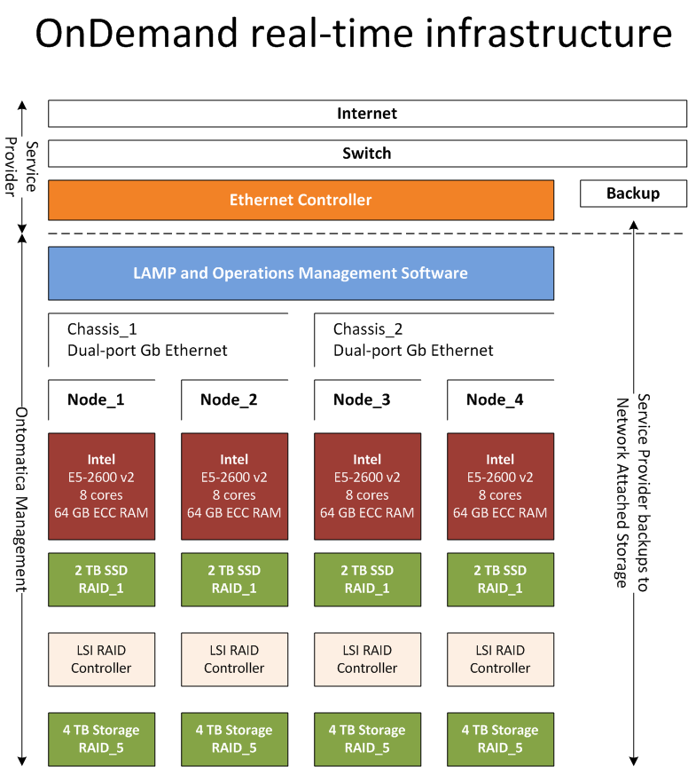

.. _$_02-core-17-infrastructure:

============================
Infrastructure and Reporting
============================

.. _return-to-top-02-core-17-infrastructure:

This section addresses:

.. rst:role:: USDA #7

   Allow real-time processing of queries from users.
   
.. rst:role:: USDA #13

   Support growth from current 3 GB of table space to as much as 2 TB and further possible future expansion.

.. rst:role:: USDA #14

   Allow for tracking of the use of the database (e.g., frequency of record/field selection for viewing or export).

Table of Contents
-----------------

.. contents::
   :depth: 2
   :local:

--------------
Infrastructure
--------------

Infrastructure is designed for high performance and automated :ref:`fail-over <terms-Failover>` |_| if a core component (e.g. memory, storage) fails.

---------
Reporting
---------

Infrastructure also presents comprehensive utilization data. For example:

- Record all Navigator queries
   - by IP address
   - by date
   - by query

- Record all REST transactions
   - by IP address
   - by date
   - by transaction

Example from access to Nobel Prize application.

- ID: 7396

- date: 2014-11-15 02:00:02

- IP address: 72.167.253.87

- query terms: (see example below, beginning "select name from gender where parent= ...")

::

   7394  0.25 secs            /cgi-bin/flamenco.cgi/_Nobel_Prize_Winners_-_14-01-16_/Flamenco
   
   7395  2014-11-15 02:00:02  /cgi-bin/flamenco.cgi/_Nobel_Prize_Winners_-_14-01-16_/Flamenco
   select count(*) from items
   PRELOAD
   username, apss
   
   LOGGING SQL
   insert into log (interface, userid, taskid, event, detail, sort, count, ipaddr, indx, facet, item, prevurl, offset, query, groupby) values ('Flamenco', 0, 0, 'opening', '', '', 854, '72.167.253.87', NULL, '', '', NULL, 0, '', '')
   opening
   None
   select child.id, count(*) as count, child.name as name from gender as child, item_gender as map where child.parent = 0 and map.id = child.id group by child.id having count > 0 order by name limit 0,13
   select name from gender where parent=1
   select name from gender where parent=2
   select child.id, count(*) as count, child.name as name from country as child, item_country as map where child.parent = 0 and map.id = child.id group by child.id having count > 0 order by name limit 0,13
   select name from country where parent=1
   select name from country where parent=2
   select name from country where parent=3
   select name from country where parent=55
   select name from country where parent=4
   select name from country where parent=5
   select name from country where parent=6
   select name from country where parent=7
   select name from country where parent=8
   select name from country where parent=9
   select name from country where parent=10
   select name from country where parent=57
   select name from country where parent=11
   select child.id, count(*) as count, child.name as name from affiliation as child, item_affiliation as map where child.parent = 0 and map.id = child.id group by child.id having count > 0 order by name limit 0,13
   select name from affiliation where parent=1
   select name from affiliation where parent=3
   select name from affiliation where parent=8
   select name from affiliation where parent=13
   select name from affiliation where parent=22
   select name from affiliation where parent=32
   select name from affiliation where parent=34
   select name from affiliation where parent=40
   select name from affiliation where parent=683
   select name from affiliation where parent=48
   select name from affiliation where parent=50
   select name from affiliation where parent=52
   select name from affiliation where parent=54
   select child.id, count(*) as count, child.name as name from item_prize as map, prize as child where child.parent = 0 and map.id = child.id group by child.id having count > 0 order by name limit 0,13
   select name from prize where parent=1
   select name from prize where parent=2
   select name from prize where parent=3
   select name from prize where parent=4
   select name from prize where parent=5
   select name from prize where parent=6
   select child.id, count(*) as count, child.name as name from item_year as map, year as child where child.parent = 0 and map.id = child.id group by child.id having count > 0 order by name limit 0,13
   select name from year where parent=1
   select name from year where parent=11
   select name from year where parent=22
   select name from year where parent=33
   select name from year where parent=44
   select name from year where parent=52
   select name from year where parent=63
   select name from year where parent=74
   select name from year where parent=85
   select name from year where parent=96
   select name from year where parent=107
   select name from year where parent=122
   
   7395  0.24 secs            /cgi-bin/flamenco.cgi/_Nobel_Prize_Winners_-_14-01-16_/Flamenco

----------------
Service Provider
----------------

Ontomatica plans to use `Cybercon <http://www.cybercon.com/>`_ as the hosting service provider.

:ref:`Return to top <return-to-top-02-core-17-infrastructure>`

.. |_| unicode:: 0x80

