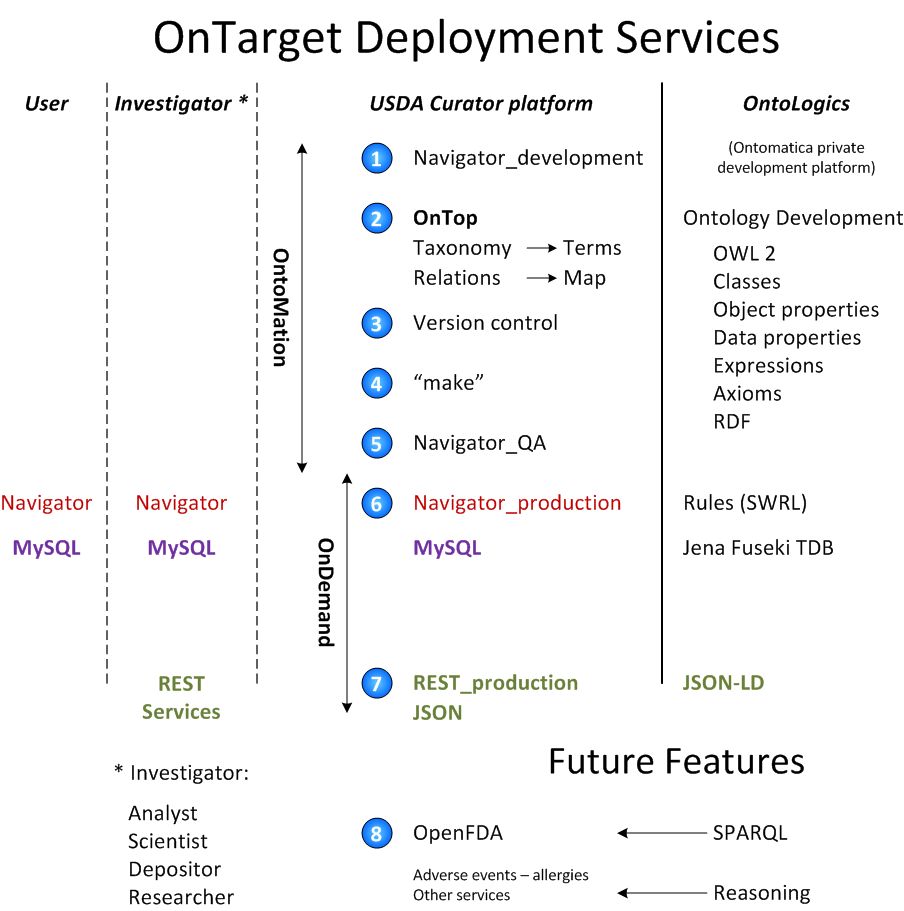

.. _$_02-core-18-deployment:

===================
Deployment Services
===================

.. _return-to-top-02-core-18-deployment:

This section addresses:

.. rst:role:: Ontomatica defined objective

Table of Contents
-----------------

.. contents::
   :depth: 2
   :local:

--------
OnTarget
--------

:ref:`OntoMation<terms-OntoMation>` |_| manages the promotion of application content:
- from :ref:`development<terms-Development>` |_| (1)
- to :ref:`quality assurance<terms-Quality-Assurance>` |_| (5)
- to :ref:`production<terms-Production>` |_| (6 and 7).

-----
OnTop
-----

Description (2)

----------
Versioning
----------

Description about GitHub (3)

------
make++
------

Description (4)

::

   #!/usr/bin/env python
   
   # This script processes the entries in nobel.txt to produce the files
   # needed to create a Navigator instance.
   
   attrnames = [line.split('\t')[0] for line in open('attrs.tsv')]
   facetnames = [line.split('\t')[0] for line in open('facets.tsv')]
   facets = dict([(name, []) for name in facetnames])
   maps = dict([(name, []) for name in facetnames])
   items, nameitems = {}, {}
   texts = {}
   
   # First, collect all the facet values and items.
   
   fields, categories, text = {}, [], ''
   for line in open('nobel.txt'):
       if line.strip():
           name, values = line.split(':', 1)
           values = values.strip()
           if name == 'year':
               values += ', ' + values[:3] + '0s' # group years by decade
           if name in facetnames:
               chunks = values.split('(')
               for i in range(1, len(chunks)):
                   chunks[i] = chunks[i].split(')', 1)[-1]
               values = ''.join(chunks)
               for value in values.split(';'):
                   text += ' ' + value.replace(',', ' ')
                   path = [segment.strip() for segment in value.split(',')]
                   path.reverse()
                   path = tuple(path)
                   if name == 'affiliation' and len(path) == 1:
                       continue
                   if path not in facets[name]:
                       facets[name].append(path)
                   categories.append((name, path))
           if name in attrnames:
               text += ' ' + values
               fields[name] = values
       elif fields:
           if fields['name'] in nameitems:
               item = nameitems[fields['name']]
               items[item].update(fields)
               texts[item] += text
           else:
               item = len(items) + 1
               items[item], texts[item] = fields, text
               nameitems[fields['name']] = item
           for name, path in categories:
               maps[name].append((item, path))
           fields, categories, text = {}, [], ''
   
   # Then write the facet tables, generating ids as we go.
   
   for name in facetnames:
       facets[name].sort()
       pathids = {}
       file = open('%s_terms.tsv' % name, 'w')
       lastid = 0
       for path in facets[name]:
           for i in range(1, len(path) + 1):
               subpath = path[:i]
               if subpath not in pathids:
                   pathids[subpath] = lastid = lastid + 1
                   file.write('%d\t%s\n' % (lastid, '\t'.join(subpath)))
       file.close()
       file = open('%s_map.tsv' % name, 'w')
       for item, path in maps[name]:
           file.write('%d\t%d\n' % (item, pathids[path]))
       file.close()
   
   # Write the table of items.
   
   file = open('items.tsv', 'w')
   itemids = items.keys()
   itemids.sort()
   for item in itemids:
       fields = []
       for name in attrnames:
           fields.append(items[item].get(name, ''))
       file.write('%d\t%s\n' % (item, '\t'.join(fields)))
   file.close()
   
   # Finally, write the text associated with each item.
   
   file = open('text.tsv', 'w')
   for item in itemids:
       file.write('%d\t%s\n' % (item, ' '.join(texts[item].split())))
   file.close()

----------
OntoLogics
----------

Ontomatica's OntoLogics services are not part of Proposal.

---------------
Future Features
---------------

Presented `here <$_06-future.html>`_

:ref:`Return to top <return-to-top-02-core-18-deployment>`

.. |_| unicode:: 0x80

