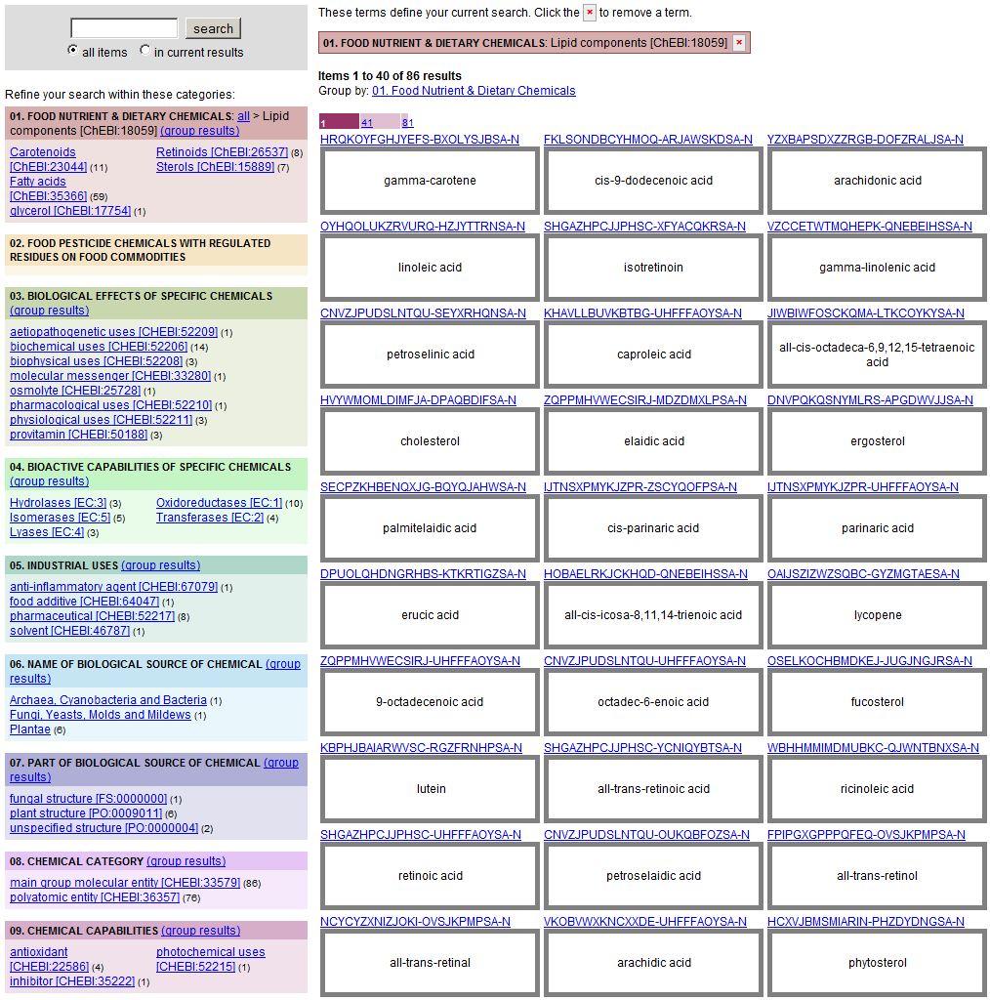
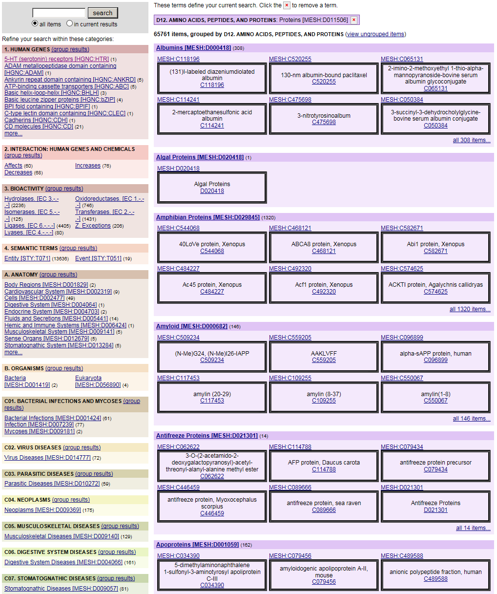
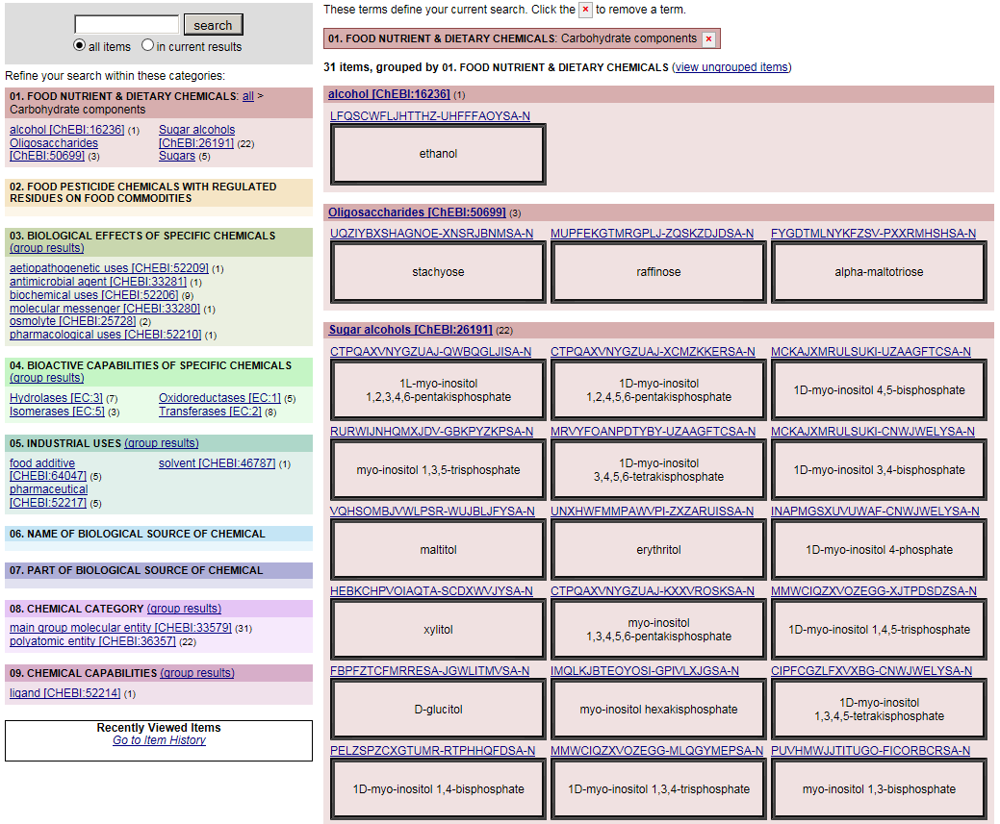
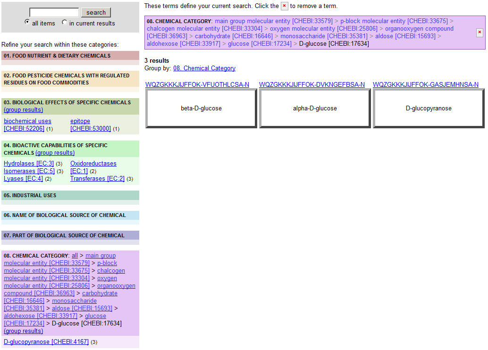
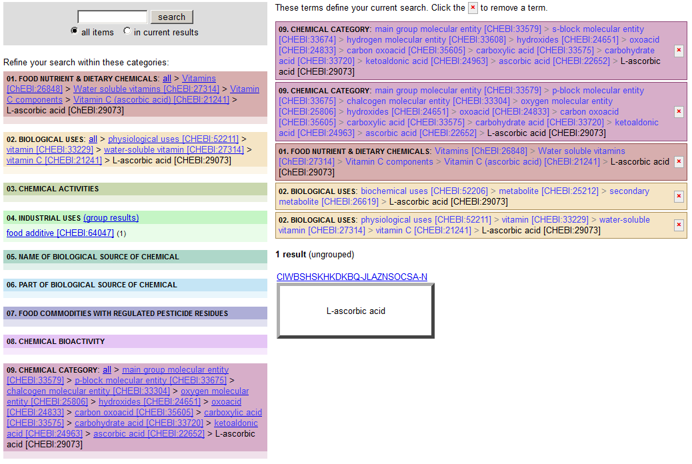
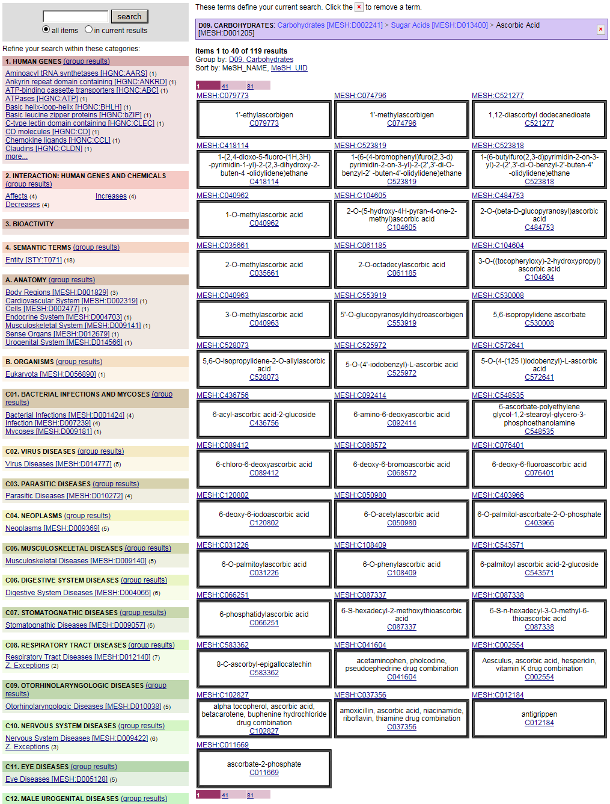
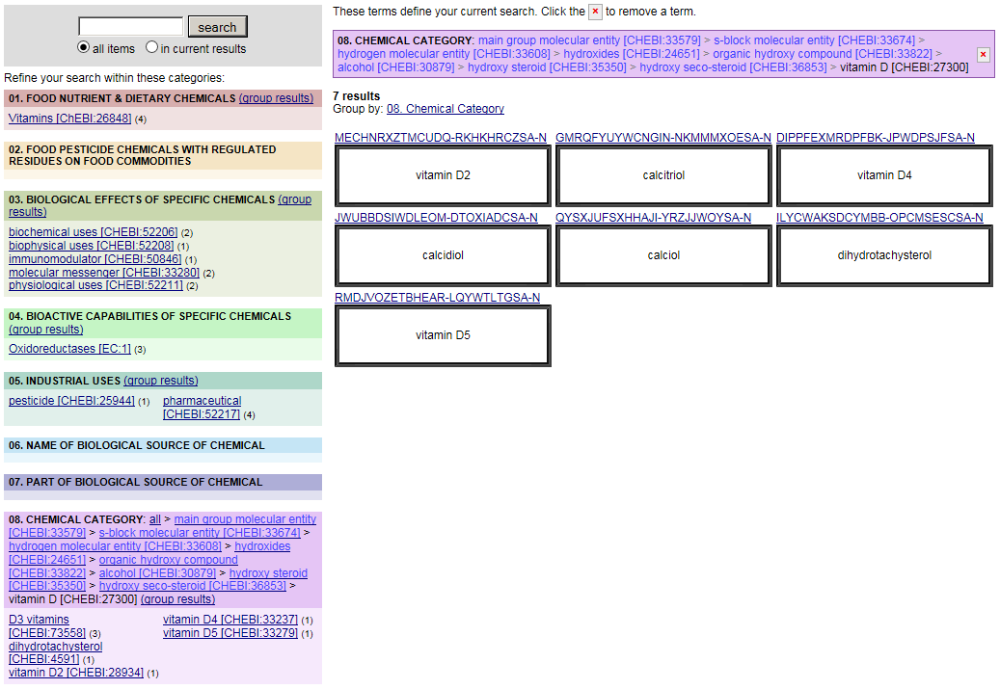
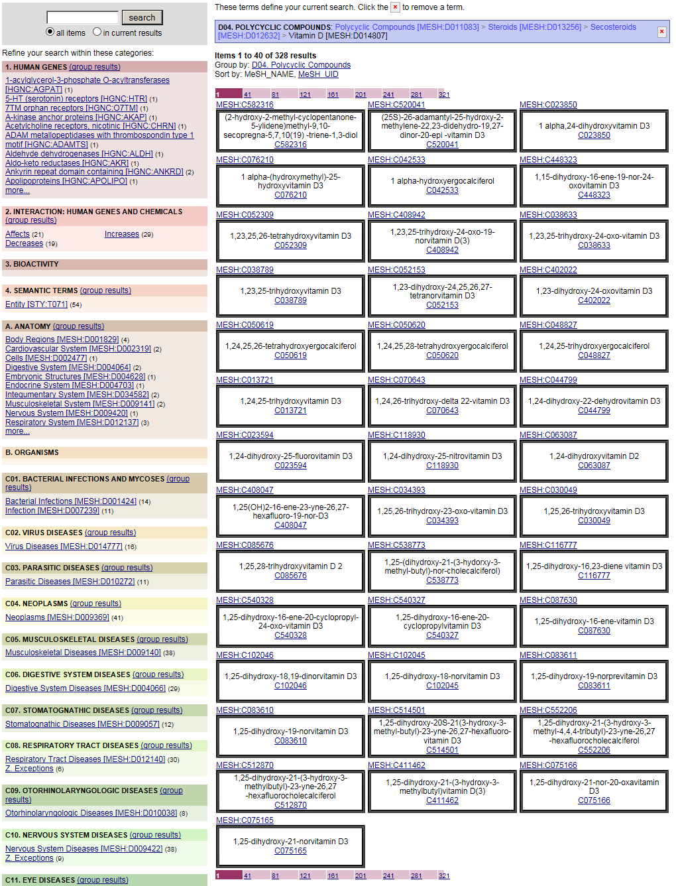
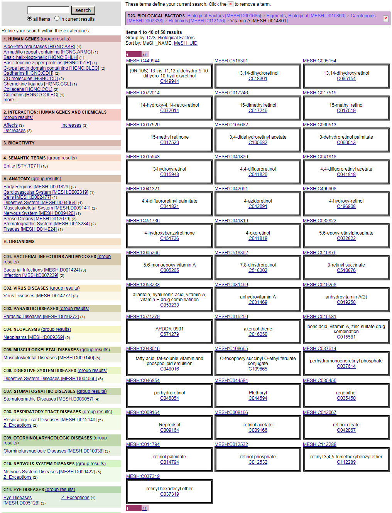
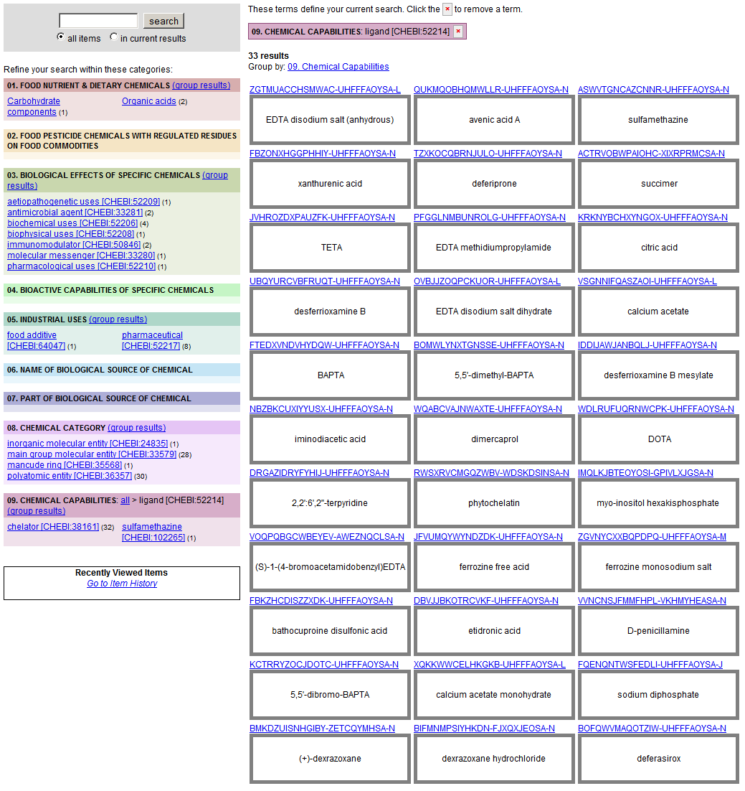

.. _$_03-detail-1-chemicals-1-nutrients-1-web:

=================================
Nutrients from ChEFS and ChEMATIC
=================================

Table of Contents
-----------------

.. contents::
   :depth: 2
   :local:

-----------------------------
Lipid Classes and Lipid Types
-----------------------------

ChEFS
   86 chemicals and their relationships with 8 Facets and 200+ Facet Terms.

   `ChEFS: lipids class <http://72.167.253.87/cgi-bin/flamenco.cgi/_ChEFS_/Flamenco?q=facet_NTRNT:2350>`_

ChEMATIC
   8,597 substances and their relationships with many Facets and many Facet Terms.

   `ChEMATIC: lipids class <http://72.167.253.87/cgi-bin/flamenco.cgi/_ChEMATIC_v02_-_14-08-21_/Flamenco?q=facet_MD_10:68302775&group=facet_MD_10>`_

.. image:: $_03-detail-1-chemicals-1-nutrients-1-web-02-chematic-lipids_.png

---------------------------------
Protein Classes and Protein Types
---------------------------------

ChEMATIC
   65,761 amino acids, peptides, and proteins and their relationships with many Facets and Facet Terms.

   `ChEMATIC: proteins <http://72.167.253.87/cgi-bin/flamenco.cgi/_ChEMATIC_v02_-_14-08-21_/Flamenco?q=facet_MD_12:68349711&action=force&group=facet_MD_12>`_

ChEMATIC
   186 dietary proteins and their relationships with many Facets and Facet Terms.

   `ChEMATIC: dietary proteins <http://72.167.253.87/cgi-bin/flamenco.cgi/_ChEMATIC_v02_-_14-08-21_/Flamenco?q=facet_MD_12:68385878&group=facet_MD_12>`_

.. image:: $_03-detail-1-chemicals-1-nutrients-1-web-08-chematic-proteins-dietary_.png

-------------------------------------------
Carbohydrate Classes and Carbohydrate Types
-------------------------------------------

ChEFS
   31 carbohydrate components and their relationships with many Facets and Facet Terms.

   `ChEFS: carbohydrate classes <http://72.167.253.87/cgi-bin/flamenco.cgi/_ChEFS_/Flamenco?q=facet_NTRNT:250&group=facet_NTRNT>`_

ChEFS
   D-glucose class and relationship with 3 Facets.

   `ChEFS: D-glucose class <http://72.167.253.87/cgi-bin/flamenco.cgi/_ChEFS_/Flamenco?q=facet_ChEBI_R105:127976>`_

.. image:: $_03-detail-1-chemicals-1-nutrients-1-web-09-chefs-carbohydrates-glucose-class_.png

ChEMATIC
   Glucose class

   `ChEMATIC: glucose class <http://72.167.253.87/cgi-bin/flamenco.cgi/_ChEMATIC_-_14-01-09_/Flamenco?q=facet_MD09:68296563>`_

---------------------------------
Vitamin Classes and Vitamin Types
---------------------------------

ChEFS
   L-ascorbic acid and relationship with 4 Facets.

   `ChEFS: L-ascorbic acid <http://72.167.253.87/cgi-bin/flamenco.cgi/_ChEFS_1.0_/Flamenco?q=facet_ChEBI_R105:35805,116996/facet_NTRNT:19650/facet_USES_BIOL:2929,6117&morelike=1>`_

ChEMATIC
   119 ascorbic acids and their relationships with many Facets and Facet Terms.

   `ChEMATIC: ascorbic acid class <http://72.167.253.87/cgi-bin/flamenco.cgi/_ChEMATIC_v02_-_14-08-21_/Flamenco?q=facet_MD_09:68301011>`_

ChEFS
   Vitamin D class and relationship with 5 Facets.
   
   `ChEFS: vitamin D class <http://72.167.253.87/cgi-bin/flamenco.cgi/_ChEFS_/Flamenco?q=facet_ChEBI_R105:39980>`_

ChEMATIC
   328 vitamin D compounds and their relationships with many Facets and Facet Terms.
   
   `ChEMATIC: vitamin D class <http://72.167.253.87/cgi-bin/flamenco.cgi/_ChEMATIC_v02_-_14-08-21_/Flamenco?q=facet_MD_04:68242273>`_

ChEMATIC
   58 vitamin A compounds and their relationships with many Facets and Facet Terms.
   
   `ChEMATIC: vitamin A class <http://72.167.253.87/cgi-bin/flamenco.cgi/_ChEMATIC_v02_-_14-08-21_/Flamenco?q=facet_MD_23:68508273>`_

---------------------------------------------
Phytochemical Classes and Phytochemical Types
---------------------------------------------

   `ChEFS: flavonols class <http://72.167.253.87/cgi-bin/flamenco.cgi/_ChEFS_/Flamenco?q=facet_ChEBI_R105:360248>`_

   `ChEFS: flavanones class <http://72.167.253.87/cgi-bin/flamenco.cgi/_ChEMATIC_v02_-_14-08-21_/Flamenco?q=facet_MD_03:68213292>`_

   `ChEFS: flavan-3-ols class <http://72.167.253.87/cgi-bin/flamenco.cgi/_ChEMATIC_v02_-_14-08-21_/Flamenco?q=facet_MD_03:68134699/FLAVAN-3-OLS&group=facet_MD_03>`_

   `ChEFS: anthocyanidins class <http://72.167.253.87/cgi-bin/flamenco.cgi/_ChEMATIC_v02_-_14-08-21_/Flamenco?q=facet_MD_09:68291632&group=facet_MD_09>`_

   `ChEFS: isoflavones class <http://72.167.253.87/cgi-bin/flamenco.cgi/_ChEMATIC_v02_-_14-08-21_/Flamenco?q=facet_MD_03:68214332>`_

   `ChEFS: proanthocyanidins class <http://72.167.253.87/cgi-bin/flamenco.cgi/_ChEMATIC_v02_-_14-08-21_/Flamenco?q=facet_MD_03:68214815>`_

-------------------------------
Ligand Classes and Ligand Types
-------------------------------

ChEFS
   33 chemicals and their relationships with 5 Facets and 100+ Facet Terms.

   `ChEFS: ligands <http://72.167.253.87/cgi-bin/flamenco.cgi/_ChEFS_/Flamenco?q=facet_CHMCL_ACTS:12999>`_

ChEMATIC
   247 chemicals from different categories and their relationships with several Facets and Facet Terms.

   `ChEMATIC: ligands <http://72.167.253.87/cgi-bin/flamenco.cgi/_ChEMATIC_v02_-_14-08-21_/Flamenco?words=ligand&q=&facet=&in=all>`_

.. image:: $_03-detail-1-chemicals-1-nutrients-1-web-04-chematic-ligands_.png

