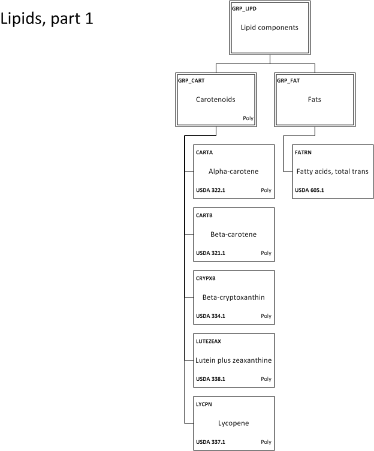
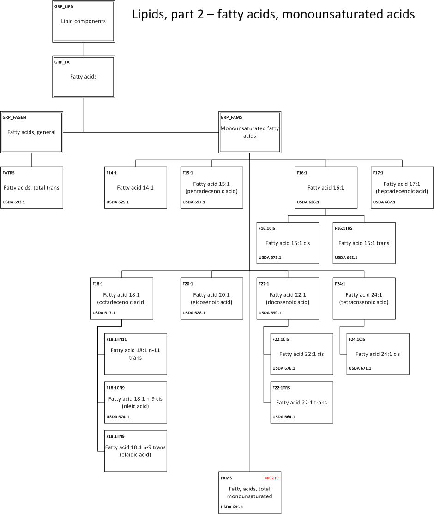
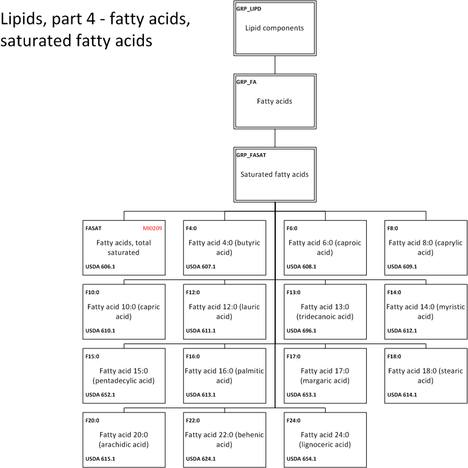

.. _$_03-detail-1-chemicals-1-nutrients-3-taxonomy-4-d-lipids:

======
Lipids
======

Part 1
^^^^^^

   
   This is the caption for the figure

Part 2
^^^^^^

   
   This is the caption for the figure

Part 3
^^^^^^

.. figure:: 4_f_Lipids_part_3.png
   :align: center
   
   This is the caption for the figure

Part 4
^^^^^^

   
   This is the caption for the figure

Part 5
^^^^^^

   
   This is the caption for the figure

