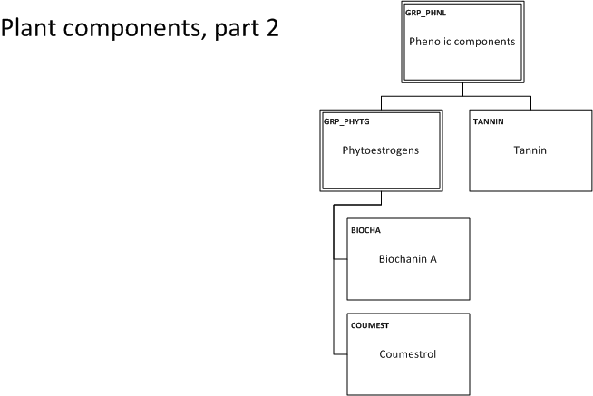

.. _$_03-detail-1-chemicals-1-nutrients-3-taxonomy-4-l-plant-components:

================
Plant Components
================

Taxonomy
^^^^^^^^

   
Specific entries from ChEFS and ChEMATIC
^^^^^^^^^^^^^^^^^^^^^^^^^^^^^^^^^^^^^^^^

`ChEFS: flavonols class <http://72.167.253.87/cgi-bin/flamenco.cgi/_ChEFS_/Flamenco?q=facet_ChEBI_R105:360248>`_

`ChEFS: flavanones class <http://72.167.253.87/cgi-bin/flamenco.cgi/_ChEMATIC_v02_-_14-08-21_/Flamenco?q=facet_MD_03:68213292>`_

`ChEFS: flavan-3-ols class <http://72.167.253.87/cgi-bin/flamenco.cgi/_ChEMATIC_v02_-_14-08-21_/Flamenco?q=facet_MD_03:68134699/FLAVAN-3-OLS&group=facet_MD_03>`_

`ChEFS: anthocyanidins class <http://72.167.253.87/cgi-bin/flamenco.cgi/_ChEMATIC_v02_-_14-08-21_/Flamenco?q=facet_MD_09:68291632&group=facet_MD_09>`_

`ChEFS: isoflavones class <http://72.167.253.87/cgi-bin/flamenco.cgi/_ChEMATIC_v02_-_14-08-21_/Flamenco?q=facet_MD_03:68214332>`_

`ChEFS: proanthocyanidins class <http://72.167.253.87/cgi-bin/flamenco.cgi/_ChEMATIC_v02_-_14-08-21_/Flamenco?q=facet_MD_03:68214815>`_

`ChEFS: flavonols class <http://72.167.253.87/cgi-bin/flamenco.cgi/_ChEFS_/Flamenco?q=facet_ChEBI_R105:360248>`_

`ChEFS: quercetin <http://72.167.253.87/cgi-bin/flamenco.cgi/_ChEFS_/Flamenco?q=facet_CHMCL_ACTS:13315&group=facet_CHMCL_ACTS>`_

`ChEFS: kaempferol <http://72.167.253.87/cgi-bin/flamenco.cgi/_ChEFS_/Flamenco?q=facet_ChEBI_R105:37390&group=facet_ChEBI_R105>`_

`ChEFS: myricetin <http://72.167.253.87/cgi-bin/flamenco.cgi/_ChEFS_/Flamenco?q=facet_NTRNT:13075&group=facet_NTRNT>`_

`ChEFS: isorhamnetin <http://72.167.253.87/cgi-bin/flamenco.cgi/_ChEFS_/Flamenco?q=facet_NTRNT:13175&group=facet_NTRNT>`_

`ChEFS: flavones class <http://72.167.253.87/cgi-bin/flamenco.cgi/_ChEMATIC_v02_-_14-08-21_/Flamenco?q=facet_MD_03:68213518>`_

`ChEFS: luteolin <http://72.167.253.87/cgi-bin/flamenco.cgi/_ChEFS_/Flamenco?q=facet_NTRNT:13550&group=facet_NTRNT>`_

`ChEFS: apigenin <http://72.167.253.87/cgi-bin/flamenco.cgi/_ChEFS_/Flamenco?q=facet_NTRNT:13475&group=facet_NTRNT>`_

`ChEFS: flavanones class <http://72.167.253.87/cgi-bin/flamenco.cgi/_ChEMATIC_v02_-_14-08-21_/Flamenco?q=facet_MD_03:68213292>`_

`ChEFS: hesperetin <http://72.167.253.87/cgi-bin/flamenco.cgi/_ChEFS_/Flamenco?q=facet_NTRNT:13250&group=facet_NTRNT>`_

`ChEFS: naringenin <http://72.167.253.87/cgi-bin/flamenco.cgi/_ChEFS_/Flamenco?q=facet_NTRNT:13300&group=facet_NTRNT>`_

`ChEFS: eriodictyol <http://72.167.253.87/cgi-bin/flamenco.cgi/_ChEFS_/Flamenco?q=facet_NTRNT:13375&group=facet_NTRNT>`_

`ChEFS: flavan-3-ols class <http://72.167.253.87/cgi-bin/flamenco.cgi/_ChEMATIC_v02_-_14-08-21_/Flamenco?q=facet_MD_03:68134699/FLAVAN-3-OLS&group=facet_MD_03>`_

`ChEFS: (+)-catechin <http://72.167.253.87/cgi-bin/flamenco.cgi/_ChEFS_/Flamenco?q=facet_NTRNT:14125&group=facet_NTRNT>`_

`ChEFS: (+)-gallocatechin <http://72.167.253.87/cgi-bin/flamenco.cgi/_ChEFS_/Flamenco?q=facet_USES_BIOL:2973&group=facet_USES_BIOL>`_

`ChEFS: (-)-epicatechin <http://72.167.253.87/cgi-bin/flamenco.cgi/_ChEFS_/Flamenco?q=facet_NTRNT:14150&group=facet_NTRNT>`_

`ChEFS: (-)-epigallocatechin 3-gallate <http://72.167.253.87/cgi-bin/flamenco.cgi/_ChEFS_/Flamenco?q=facet_NTRNT:14175&group=facet_NTRNT>`_

`ChEFS: theaflavin <http://72.167.253.87/cgi-bin/flamenco.cgi/_ChEFS_/Flamenco?q=facet_NTRNT:14250>`_

`ChEFS: theaflavin 3-gallate <http://72.167.253.87/cgi-bin/flamenco.cgi/_ChEFS_/Flamenco?q=facet_NTRNT:14275>`_

`ChEFS: theaflavin 3'-gallate <http://72.167.253.87/cgi-bin/flamenco.cgi/_ChEFS_/Flamenco?q=facet_NTRNT:14300>`_

`ChEFS: theaflavin 3,3' digallate <http://72.167.253.87/cgi-bin/flamenco.cgi/_ChEFS_/Flamenco?q=facet_NTRNT:14325>`_

`ChEFS: thearubigins <http://72.167.253.87/cgi-bin/flamenco.cgi/_ChEFS_/Flamenco?q=facet_NTRNT:14350>`_

`ChEFS: anthocyanidins class <http://72.167.253.87/cgi-bin/flamenco.cgi/_ChEMATIC_v02_-_14-08-21_/Flamenco?q=facet_MD_09:68291632&group=facet_MD_09>`_

`ChEFS: cyanidin <http://72.167.253.87/cgi-bin/flamenco.cgi/_ChEFS_/Flamenco?q=facet_NTRNT:12825&group=facet_NTRNT>`_

`ChEFS: delphinidin <http://72.167.253.87/cgi-bin/flamenco.cgi/_ChEFS_/Flamenco?q=facet_NTRNT:12850&group=facet_NTRNT>`_

`ChEFS: malvidin <http://72.167.253.87/cgi-bin/flamenco.cgi/_ChEFS_/Flamenco?q=facet_NTRNT:12900>`_

`ChEFS: pelargonidin <http://72.167.253.87/cgi-bin/flamenco.cgi/_ChEFS_/Flamenco?q=facet_NTRNT:12925&group=facet_NTRNT>`_

`ChEFS: peonidin <http://72.167.253.87/cgi-bin/flamenco.cgi/_ChEFS_/Flamenco?q=facet_NTRNT:12950>`_

`ChEFS: petunidin <http://72.167.253.87/cgi-bin/flamenco.cgi/_ChEFS_/Flamenco?q=facet_NTRNT:12975>`_

`ChEFS: isoflavones class <http://72.167.253.87/cgi-bin/flamenco.cgi/_ChEMATIC_v02_-_14-08-21_/Flamenco?q=facet_MD_03:68214332>`_

`ChEFS: proanthocyanidins class <http://72.167.253.87/cgi-bin/flamenco.cgi/_ChEMATIC_v02_-_14-08-21_/Flamenco?q=facet_MD_03:68214815>`_

`ChEFS: proanthocyanidin A2 <http://72.167.253.87/cgi-bin/flamenco.cgi/_ChEFS_/Flamenco?q=facet_NTRNT:13800&group=facet_NTRNT>`_

`ChEFS: ephedrine <http://72.167.253.87/cgi-bin/flamenco.cgi/_ChEFS_/Flamenco?q=facet_ChEBI_R105:304978&group=facet_ChEBI_R105>`_

`ChEMATIC: oxalic acid <http://72.167.253.87/cgi-bin/flamenco.cgi/_ChEMATIC_v02_-_14-08-21_/Flamenco?q=facet_MD_02:68043875>`_

`USDA: oxalic acid content of selected vegetables <http://www.ars.usda.gov/Services/docs.htm?docid=9444>`_

