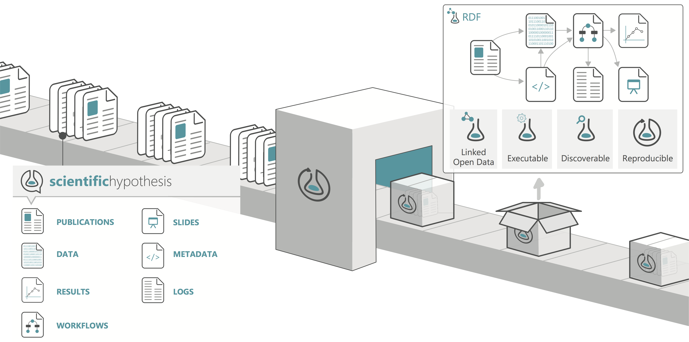
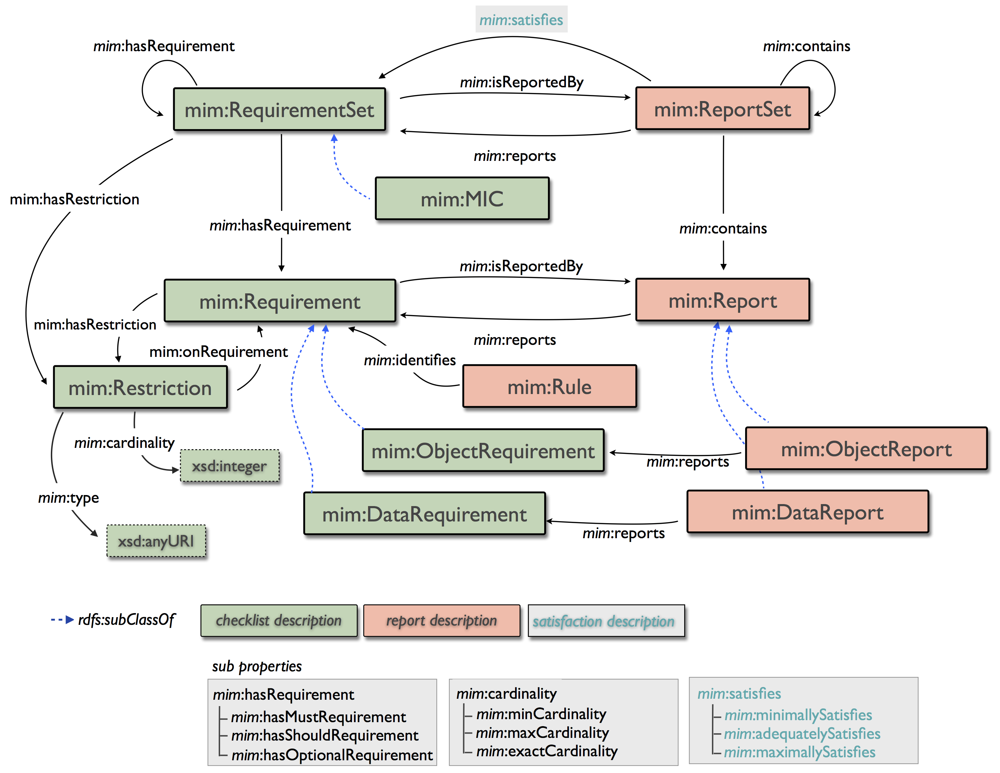

.. _$_03-detail-8-repository-1-structure:

====================
Repository Structure
====================

Intro text here

Table of Contents
-----------------

.. contents::
   :depth: 1
   :local:

-----------------
Repository Design
-----------------

Data structure syntax is RDF.

Publications and Slide are stored in Reference Library.

Metadata, Results and Data are represented as Graphs and stored in appropriate Graph database.

Work-flow processes are defined in Taverna; work-flow meta data is associated with appropriate Graph application.

----------------------------
Repository Information Model
----------------------------

Discussion about Minimum Information Model ontology

