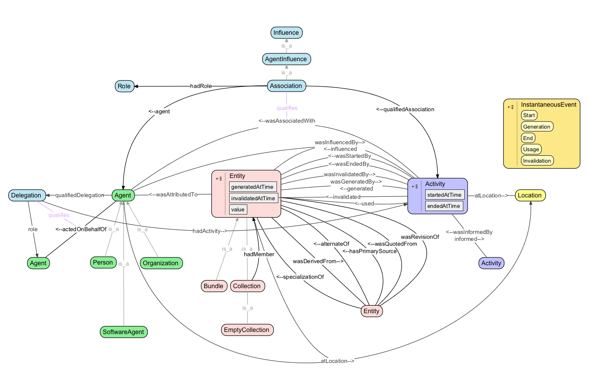
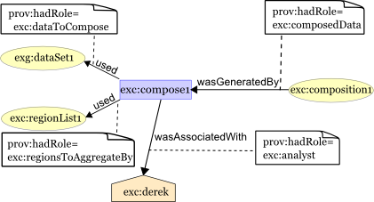

.. _$_03-detail-9-technology-3-prov:

==========================
Provenance Ontology (PROV)
==========================

Table of Contents
-----------------

.. contents::
   :depth: 1
   :local:

---------------------------
Graph - Provenance Ontology
---------------------------

The PROV :ref:`graph <terms-Graph>` is depicted in this `OWL-generated illustration <http://www.ontomatica.com/public/organizations/BETV/prov_graph.html>`_.

The PROV class hierarchy is depicted in this `illustration <http://www.ontomatica.com/public/organizations/BETV/prov_class_hierarchy.html>`_.

------------------------------------------
Summary Illustration - Provenance Ontology
------------------------------------------

An overview of PROV :cite:`6045` is depicted in this illustration:

.. figure:: $_03-detail-9-technology-3-prov-1-key-concept_.png

-------------------------------------------
Detailed Illustration - Provenance Ontology
-------------------------------------------

------------------------------
Illustration - Provenance Plan
------------------------------

.. figure:: $_03-detail-9-technology-3-prov-3-plan_.png
   :align: center

-------------------------------
Illustration - Provenance Roles
-------------------------------

------------------------------
Illustration - Provenance Time
------------------------------

.. figure:: $_03-detail-9-technology-3-prov-5-time_.png
   :align: center

